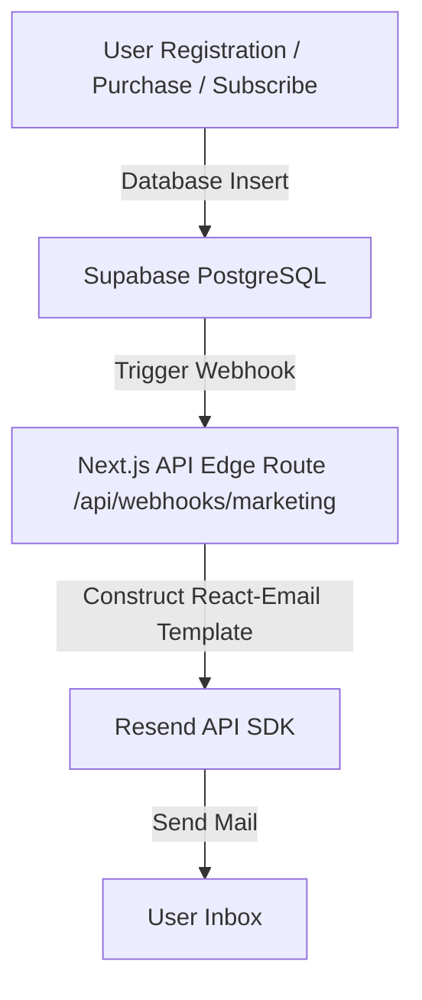

# Susmita Nursery Dashboard — Architectural Integration Plan

This document establishes the implementation blueprint for the new Admin & Customer Dashboard web application for **Susmita Nursery**. It includes a real-world comparative analysis of repository structures, Supabase security configurations, database schemas, and email marketing workflows.

---

## 1. Architectural Strategy: Separate Web App vs. Integrated Route

A major decision when developing a dashboard is whether to build it as a separate project or integrate it directly into the existing repository. Below is a comparative breakdown of these two strategies:

### Comparative Analysis Matrix

| Metric / Dimension | Option A: Integrated Route Group (`/dashboard`) | Option B: Separate Web App (e.g. `dashboard.susmitanursery.com`) |
| :--- | :--- | :--- |
| **Developer Velocity** | **Very High**: Direct access to shared TypeScript types, layout components, and utility helper files. No duplication. | **Moderate**: Requires duplicating styles/design tokens or building a shared npm component library. |
| **Hosting & Maintenance** | **Low Cost**: Single Vercel/Netlify hosting instance. Single domain configuration. | **Higher Cost**: Multi-domain configuration, separate CI/CD pipelines, and multiple server deployments. |
| **Authentication Flow** | **Seamless**: Supabase cookie session sharing is native to the domain. Simple Next.js middleware protection. | **Complex**: Requires Cross-Origin Resource Sharing (CORS) setup, dynamic redirect URL configs, and cookie propagation. |
| **Performance (Lighthouse)** | **Good**: Public site bundle sizes remain small *if* heavy dashboard libraries (e.g., charts, tables) use dynamic loading. | **Excellent**: Public website bundles are 100% free of admin dependencies (e.g., Recharts, TanStack Table). |
| **Security & Isolation** | **Moderate**: Protected by codebase route boundaries. A vulnerability in public files could expose routes. | **High**: Admin logic is physically isolated in a separate codebase and cannot leak public client assets. |

### Recommendation
For a growing horticultural e-commerce business like Susmita Nursery, we **strongly recommend Option A: Integrated Route Group**. 

Implementing this via Next.js Route Groups (creating a `src/app/(dashboard)/dashboard` directory) keeps the repository unified, dramatically speeds up development, and eliminates CORS and cross-subdomain cookie issues. By using Next.js code splitting and dynamic imports (`next/dynamic`), we can prevent administrative dependencies (like charts and tables) from impacting the public website's loading performance.

---

## 2. Supabase Auth & Role-Based Security (RBAC)

To safeguard admin records, we will implement role-based authentication using **Supabase Metadata** and protect routes using **Next.js Middleware**.

### Step 1: User Roles Setup
During user registration, roles are written to the user's `app_metadata` inside Supabase. We can set up a Database Trigger that defaults new sign-ups to `customer` while reserving `admin` for internal nursery managers.

### Step 2: Next.js Route Protection Middleware
Create or update `src/middleware.ts` to intercept requests to `/dashboard` and check the user's role:

```typescript
import { createServerClient, type CookieOptions } from '@supabase/ssr'
import { NextResponse, type NextRequest } from 'next/server'

export async function middleware(request: NextRequest) {
  let response = NextResponse.next({
    request: {
      headers: request.headers,
    },
  })

  const supabase = createServerClient(
    process.env.NEXT_PUBLIC_SUPABASE_URL!,
    process.env.NEXT_PUBLIC_SUPABASE_ANON_KEY!,
    {
      cookies: {
        get(name: string) {
          return request.cookies.get(name)?.value
        },
        set(name: string, value: string, options: CookieOptions) {
          request.cookies.set({ name, value, ...options })
          response = NextResponse.next({
            request: {
              headers: request.headers,
            },
          })
          response.cookies.set({ name, value, ...options })
        },
        remove(name: string, options: CookieOptions) {
          request.cookies.set({ name, value: '', ...options })
          response = NextResponse.next({
            request: {
              headers: request.headers,
            },
          })
          response.cookies.set({ name, value: '', ...options })
        },
      },
    }
  )

  const { data: { user } } = await supabase.auth.getUser()

  // Protect all /dashboard routes
  if (request.nextUrl.pathname.startsWith('/dashboard')) {
    if (!user) {
      return NextResponse.redirect(new URL('/login', request.url))
    }

    const role = user.app_metadata?.role
    const isAdminRoute = request.nextUrl.pathname.startsWith('/dashboard/admin')

    // If customer tries to access admin-only analytics or inventory panels
    if (isAdminRoute && role !== 'admin') {
      return NextResponse.redirect(new URL('/dashboard', request.url))
    }
  }

  return response
}

export const config = {
  matcher: ['/dashboard/:path*'],
}
```

---

## 3. Database Design (Supabase PostgreSQL)

Below is the database schema designed to support orders, inventory management, and marketing subscriptions.

```sql
-- Create Profile Table Linked to Supabase Auth Users
CREATE TABLE public.profiles (
  id UUID REFERENCES auth.users ON DELETE CASCADE PRIMARY KEY,
  full_name TEXT NOT NULL,
  phone_number TEXT,
  updated_at TIMESTAMP WITH TIME ZONE DEFAULT TIMEZONE('utc'::text, NOW()) NOT NULL
);

-- Create Inventory Table
CREATE TABLE public.inventory (
  id SERIAL PRIMARY KEY,
  product_id VARCHAR(100) UNIQUE NOT NULL, -- Corresponds to static IDs in src/lib/products.ts
  stock_quantity INT NOT NULL DEFAULT 0,
  reserved_quantity INT NOT NULL DEFAULT 0, -- Checked out but pending payment
  updated_at TIMESTAMP WITH TIME ZONE DEFAULT TIMEZONE('utc'::text, NOW()) NOT NULL
);

-- Create Orders Table
CREATE TABLE public.orders (
  id UUID DEFAULT gen_random_uuid() PRIMARY KEY,
  user_id UUID REFERENCES public.profiles(id) ON DELETE SET NULL,
  total_amount NUMERIC(10, 2) NOT NULL,
  payment_status VARCHAR(50) DEFAULT 'pending' NOT NULL, -- pending, paid, failed, refunded
  order_status VARCHAR(50) DEFAULT 'processing' NOT NULL, -- processing, shipped, delivered, cancelled
  shipping_address TEXT NOT NULL,
  created_at TIMESTAMP WITH TIME ZONE DEFAULT TIMEZONE('utc'::text, NOW()) NOT NULL
);

-- Create Order Items Table
CREATE TABLE public.order_items (
  id UUID DEFAULT gen_random_uuid() PRIMARY KEY,
  order_id UUID REFERENCES public.orders(id) ON DELETE CASCADE NOT NULL,
  product_id VARCHAR(100) NOT NULL,
  quantity INT NOT NULL,
  price_at_purchase NUMERIC(10, 2) NOT NULL
);

-- Create Newsletter Subscribers Table
CREATE TABLE public.newsletter_subscribers (
  id UUID DEFAULT gen_random_uuid() PRIMARY KEY,
  email VARCHAR(255) UNIQUE NOT NULL,
  is_active BOOLEAN DEFAULT TRUE NOT NULL,
  subscribed_at TIMESTAMP WITH TIME ZONE DEFAULT TIMEZONE('utc'::text, NOW()) NOT NULL
);

-- Enable Row Level Security (RLS)
ALTER TABLE public.profiles ENABLE ROW LEVEL SECURITY;
ALTER TABLE public.inventory ENABLE ROW LEVEL SECURITY;
ALTER TABLE public.orders ENABLE ROW LEVEL SECURITY;
ALTER TABLE public.order_items ENABLE ROW LEVEL SECURITY;
ALTER TABLE public.newsletter_subscribers ENABLE ROW LEVEL SECURITY;

-- Define Policies
CREATE POLICY "Users can read own profiles" ON public.profiles FOR SELECT USING (auth.uid() = id);
CREATE POLICY "Admins can read/write inventory" ON public.inventory FOR ALL USING (auth.jwt() -> 'app_metadata' ->> 'role' = 'admin');
CREATE POLICY "Customers can read inventory" ON public.inventory FOR SELECT TO authenticated USING (true);
CREATE POLICY "Users can view own orders" ON public.orders FOR SELECT USING (auth.uid() = user_id);
```

---

## 4. Email Marketing Integration Workflows

We recommend using **Resend** combined with **React Email** templates. They provide outstanding delivery rates and a native developer experience in Next.js.

### System Integration Architecture



### Core Email Campaigns

1. **Transactional Receipts**: Sent instantly after `payment_status` changes to `'paid'` in the `orders` table.
2. **Newsletter Welcome Drip**: Sent upon insertion in the `newsletter_subscribers` table. Contains care guide resources.
3. **Cart Abandonment Automation**: A serverless cron job (e.g. via Vercel Cron or Supabase pg_cron) checks for carts created by users that have no active orders after 2 hours, sending a friendly reminder with a discount offer.

---

## 5. UI/UX Dashboard Integration

The dashboard dashboard layout will inherit the styling foundations of the core brand guidelines:

- **Typography**: Display widgets (revenue totals, stock numbers) will use `font-serif` (Cormorant Garamond) with an italicized subtitle layout to represent the botanical heritage. Body lists and tables will use `font-sans` (Inter) for structural legibility.
- **Color Accent**: Admin panels will utilize `bg-neutral-dark` for headers with `text-secondary` (Leaf Green) for positive indicators (revenue up, in-stock), and `text-accent` (Ochre/Gold) for alerts (out of stock, order pending).
- **Structure**: Uses a responsive sidebar navigation wrapper (`rounded-r-3xl` border shapes) matching the natural contours rule.

---

## 6. Implementation Phased Roadmap

* **Phase 1 (Setup)**: Initialize Supabase local project files, create schema migrations, and setup auth provider hooks.
* **Phase 2 (Auth Protection)**: Setup route groups `src/app/(dashboard)/dashboard` and configure the routing `middleware.ts`.
* **Phase 3 (CRUD Panels)**: Implement the Admin inventory controls panel (updating stock records) and Orders processing boards.
* **Phase 4 (Marketing Integrations)**: Setup Resend credentials, create React Email components, and hook up Supabase Database Webhooks.
