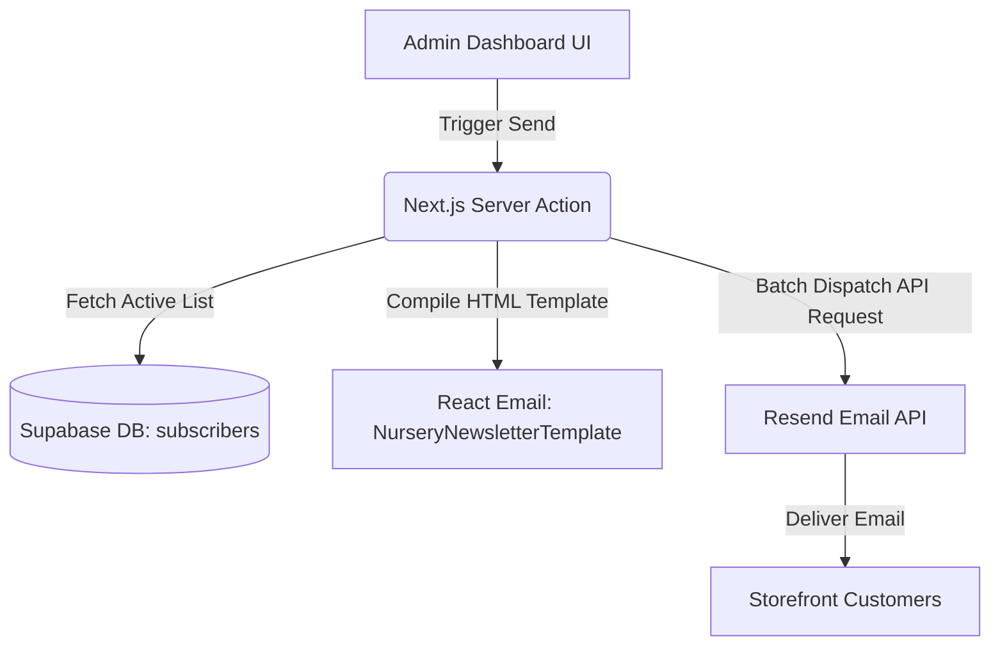

# Real-World Newsletter Integration Plan (Resend + Supabase + React Email)

This document outlines the architecture, database integration, and step-by-step implementation guide to transition the current mock newsletter dashboard into a production-ready email campaign system.

---

## 1. Core Architecture

To make this production-ready, we need three key layers:
1. **Storage Layer (Supabase)**: Utilizing the existing database schema containing the `subscribers` table, alongside a new table for sent campaign audits.
2. **Design Layer (React Email)**: A framework for designing beautiful, responsive HTML email templates using React components.
3. **Delivery Layer (Resend)**: A developer-focused email dispatch API to trigger fast, reliable email deliveries to the active subscriber mailing list.



---

## 2. Step 1: Database Migration & Triggers (Supabase)

The project migration schema (`20260722000000_init_schema.sql`) already defines a `public.subscribers` table. We will use this table directly instead of creating a new one, and add a table to log campaign histories.

### A. Add Campaigns Log Table
```sql
-- Table: newsletter_campaigns (For auditing history)
CREATE TABLE public.newsletter_campaigns (
    id UUID PRIMARY KEY DEFAULT gen_random_uuid(),
    subject TEXT NOT NULL,
    header TEXT NOT NULL,
    body TEXT NOT NULL,
    featured_product_id INTEGER REFERENCES public.products(id) ON DELETE SET NULL,
    sent_at TIMESTAMP WITH TIME ZONE DEFAULT NOW()
);
```

### B. Auto-Populate Subscribers on Signup (Trigger)
Whenever a user signs up (via credentials or Google OAuth), they are registered in `auth.users`, which fires the `handle_new_user()` trigger to build their customer profile. We will update `handle_new_user()` to also automatically create/sync their subscriber record:

```sql
CREATE OR REPLACE FUNCTION public.handle_new_user()
RETURNS TRIGGER AS $$
BEGIN
  -- 1. Create User Profile
  INSERT INTO public.profiles (id, full_name, email, phone, role, joined_date)
  VALUES (
    NEW.id,
    COALESCE(NEW.raw_user_meta_data ->> 'full_name', 'Nursery Client'),
    NEW.email,
    NEW.phone,
    COALESCE(NEW.raw_app_meta_data ->> 'role', 'customer'),
    NEW.created_at
  );

  -- 2. Auto-Populate subscriber table for email marketing
  INSERT INTO public.subscribers (email, is_active, subscribed_at)
  VALUES (NEW.email, TRUE, NEW.created_at)
  ON CONFLICT (email) DO UPDATE 
  SET is_active = TRUE;

  RETURN NEW;
END;
$$ LANGUAGE plpgsql SECURITY DEFINER;
```

---

## 3. Step 2: Set Up Dependencies

We install the Resend SDK and React Email helper packages:

```bash
npm install resend @react-email/components
```

Add your Resend API Key to the environment variables:
```env
# .env.local
RESEND_API_KEY=re_123456789...
```

---

## 4. Step 3: Design the Email Template (React Email)

Create a dedicated React Email template component matching the real-time preview style.

```tsx
// src/components/emails/NurseryNewsletter.tsx
import * as React from 'react'
import {
  Html,
  Head,
  Body,
  Container,
  Section,
  Heading,
  Text,
  Link,
  Img,
  Hr
} from '@react-email/components'

interface EmailProps {
  subject: string
  header: string
  body: string
  featuredProduct?: {
    name: string
    price: number
    image: string
    slug: string
  }
}

export const NurseryNewsletterEmail = ({
  subject,
  header,
  body,
  featuredProduct
}: EmailProps) => {
  return (
    <Html>
      <Head />
      <Body style={{ backgroundColor: '#f5f5f5', padding: '24px 0', fontFamily: 'sans-serif' }}>
        <Container style={{ backgroundColor: '#ffffff', border: '1px solid #e5e5e5', borderRadius: '16px', overflow: 'hidden', maxWidth: '580px', margin: '0 auto' }}>
          {/* Header Banner */}
          <Section style={{ backgroundColor: '#1b3b22', padding: '24px', textAlign: 'center' }}>
            <Text style={{ margin: 0, fontSize: '20px', fontWeight: 'bold', color: '#ffffff' }}>Susmita Nursery</Text>
            <Text style={{ margin: '4px 0 0 0', fontSize: '9px', textTransform: 'uppercase', letterSpacing: '0.1em', color: '#a3bfa8' }}>Botanical Companion Guidelines</Text>
          </Section>

          {/* Email Body */}
          <Section style={{ padding: '32px 24px' }}>
            <Heading style={{ fontSize: '22px', fontWeight: 'bold', color: '#111827', textAlign: 'center', margin: '0 0 16px 0' }}>
              {header}
            </Heading>
            <Text style={{ fontSize: '14px', lineHeight: '1.6', color: '#4b5563', textAlign: 'center', margin: '0 0 24px 0' }}>
              {body}
            </Text>

            {/* Featured Product Section */}
            {featuredProduct && (
              <Section style={{ backgroundColor: '#f0fdf4', border: '1px solid #dcfce7', borderRadius: '12px', padding: '16px', margin: '24px 0' }}>
                <table style={{ width: '100%' }}>
                  <tr>
                    <td style={{ width: '60px' }}>
                      
                    </td>
                    <td>
                      <Text style={{ margin: 0, fontWeight: 'bold', fontSize: '13px', color: '#111827' }}>{featuredProduct.name}</Text>
                      <Text style={{ margin: '2px 0 0 0', fontSize: '11px', color: '#6b7280' }}>₹{featuredProduct.price.toFixed(2)}</Text>
                    </td>
                    <td style={{ textAlign: 'right' }}>
                      <Link href={`https://susmitanursery.com/products/${featuredProduct.slug}`} style={{ backgroundColor: '#10b981', color: '#ffffff', padding: '8px 16px', borderRadius: '9999px', fontSize: '11px', fontWeight: 'bold', textDecoration: 'none', display: 'inline-block' }}>
                        Shop Now
                      </Link>
                    </td>
                  </tr>
                </table>
              </Section>
            )}

            <Hr style={{ borderColor: '#e5e5e5', margin: '32px 0 24px 0' }} />

            {/* Footer */}
            <Section style={{ textAlign: 'center', fontSize: '10px', color: '#9ca3af' }}>
              <Text style={{ margin: '0 0 4px 0' }}>© 2026 Susmita Nursery. Cultivating Green Companions.</Text>
              <Text style={{ margin: '0 0 12px 0' }}>Gangni, Badkulla, Nadia, 741121, W.B.</Text>
              <Link href="https://susmitanursery.com/unsubscribe" style={{ textDecoration: 'underline', color: '#9ca3af' }}>
                Unsubscribe from this mailing list
              </Link>
            </Section>
          </Section>
        </Container>
      </Body>
    </Html>
  )
}
```

---

## 5. Step 4: Implement Server Actions

We need actions to send campaigns and manage subscriber opt-out states.

### A. Sending the Campaign
```typescript
// src/server/newsletter.ts
'use server'

import { createClient } from '@/utils/supabase/server'
import { Resend } from 'resend'
import { NurseryNewsletterEmail } from '@/components/emails/NurseryNewsletter'
import React from 'react'

const resend = new Resend(process.env.RESEND_API_KEY)

interface CampaignPayload {
  subject: string
  header: string
  body: string
  featuredProductId?: number
}

export async function sendCampaignAction(payload: CampaignPayload) {
  const supabase = createClient()

  try {
    // 1. Fetch active subscriber email addresses
    const { data: subscribers, error: fetchErr } = await supabase
      .from('subscribers')
      .select('email')
      .eq('is_active', true)

    if (fetchErr) throw fetchErr
    if (!subscribers || subscribers.length === 0) {
      return { success: true, message: 'No active subscribers found.' }
    }

    // 2. Fetch product specs if highlighted
    let featuredProductDetails = undefined
    if (payload.featuredProductId) {
      const { data: product } = await supabase
        .from('products')
        .select('name, price, image, slug')
        .eq('id', payload.featuredProductId)
        .single()

      if (product) {
        featuredProductDetails = {
          name: product.name,
          price: Number(product.price),
          image: product.image,
          slug: product.slug
        }
      }
    }

    // 3. Dispatch emails (Resend batch dispatch caps at 100 emails/request)
    const emailsList = subscribers.map(sub => sub.email)
    const batchSize = 100
    for (let i = 0; i < emailsList.length; i += batchSize) {
      const currentBatch = emailsList.slice(i, i + batchSize)
      
      const batchPayload = currentBatch.map(email => ({
        from: 'Susmita Nursery <newsletter@susmitanursery.com>',
        to: email,
        subject: payload.subject,
        react: React.createElement(NurseryNewsletterEmail, {
          subject: payload.subject,
          header: payload.header,
          body: payload.body,
          featuredProduct: featuredProductDetails
        })
      }))

      const { error: sendErr } = await resend.batch.send(batchPayload)
      if (sendErr) throw sendErr
    }

    // 4. Log sent campaign in history
    await supabase.from('newsletter_campaigns').insert({
      subject: payload.subject,
      header: payload.header,
      body: payload.body,
      featured_product_id: payload.featuredProductId
    })

    return { success: true, count: emailsList.length }
  } catch (err: any) {
    console.error('Newsletter campaign error:', err)
    return { success: false, error: err.message || 'Delivery failed' }
  }
}
```

### B. Managing Subscriber Preferences (Opt-in / Opt-out Settings)
Add actions to let customers modify their subscription state from their settings pages.

```typescript
// src/server/newsletter.ts (Continued)

// Get subscription status of an email
export async function getSubscriptionStatusAction(email: string) {
  const supabase = createClient()
  try {
    const { data, error } = await supabase
      .from('subscribers')
      .select('is_active')
      .eq('email', email)
      .maybeSingle()
      
    if (error) throw error
    return { success: true, isActive: data ? data.is_active : false }
  } catch (err: any) {
    return { success: false, error: err.message }
  }
}

// Update subscription status (Opt-out / Opt-in toggle)
export async function updateSubscriptionStatusAction(email: string, isActive: boolean) {
  const supabase = createClient()
  try {
    const { error } = await supabase
      .from('subscribers')
      .upsert({ email, is_active: isActive }, { onConflict: 'email' })

    if (error) throw error
    return { success: true }
  } catch (err: any) {
    return { success: false, error: err.message }
  }
}
```

---

## 6. Step 5: Frontend Page Integration

### A. User Profile Settings (Opt-Out Panel)
In [account/page.tsx](file:///d:/Documents/01_Freelance/susmita-nursery-ecom-website/src/app/account/page.tsx), load the user's current subscription status when opening the "Profile & Settings" tab, and display it as an alert subscription option under the in-store alert configuration:

```tsx
{/* Under: Notification Settings (around line 847) */}
<div className="pt-6 border-t border-border/60 space-y-3">
  <h3 className="text-sm font-serif font-bold text-foreground">Marketing Alerts & Preferences</h3>
  <div className="space-y-2.5 text-xs">
    <label className="flex items-center gap-3 cursor-pointer">
      <input 
        type="checkbox" 
        checked={isNewsletterActive} 
        onChange={async (e) => {
          setIsNewsletterActive(e.target.checked);
          await updateSubscriptionStatusAction(profile.email, e.target.checked);
        }}
        className="rounded text-primary focus:ring-primary h-4 w-4" 
      />
      <span>Receive promotional newsletters, weekend care guides, and exclusive plant coupons</span>
    </label>
    
    {/* Other in-store reservation checkboxes */}
  </div>
</div>
```

### B. Dashboard Newsletter Directory
- In [newsletter/page.tsx](file:///d:/Documents/01_Freelance/susmita-nursery-ecom-website/src/app/%28dashboard%29/dashboard/newsletter/page.tsx), replace client-side LocalStorage parsing with database calls.
- Fetch all subscribers via a Server Action, and call `updateSubscriptionStatusAction(email, toggleState)` when toggle buttons are clicked in the dashboard table.
