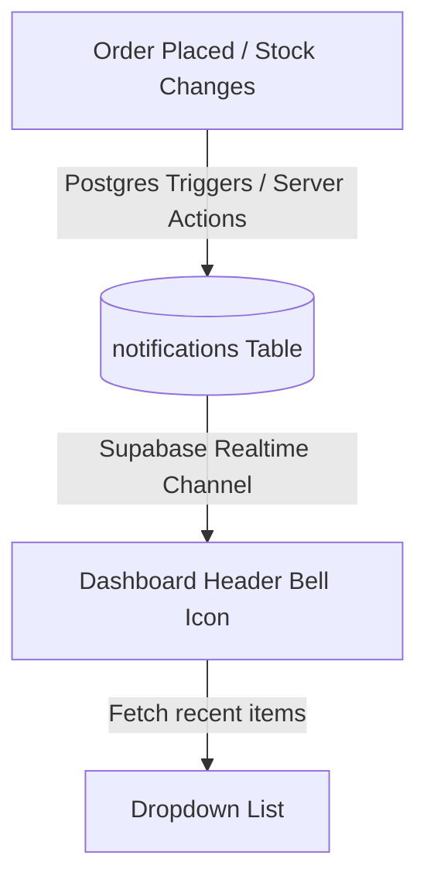

# Plan: Real-Time Dashboard Notification System

This document outlines the architecture and implementation steps to connect the **Recent Notifications** dropdown in the dashboard header to the current Supabase database.

---

## 1. Architecture Overview

To make notifications robust, persistable, and real-time, we will use a **Database-Backed + Real-time Push** model:



### Key Components:
1. **`notifications` Table**: Stores alerts (New Orders, Low Stock warnings, New Subscribers) with their read/unread status.
2. **Postgres Triggers**: Automatically generate "Low Stock" alerts when product inventories drop below 5 units, and "New Order" alerts when reservations are made.
3. **Supabase Realtime**: Subscribes the admin dashboard header to insertions in the `notifications` table for instant notifications without page refresh.

---

## 2. Technical Blueprint

### Step 1: Database Migration (`supabase/migrations/20260806020000_notifications_setup.sql`)
We will create a `notifications` table and configure Row Level Security (RLS) so only admins can read and modify it.

```sql
-- Create Notification Table
CREATE TABLE public.notifications (
    id UUID PRIMARY KEY DEFAULT gen_random_uuid(),
    type TEXT NOT NULL,          -- 'new_order', 'low_stock', 'new_subscriber'
    title TEXT NOT NULL,
    message TEXT NOT NULL,
    is_read BOOLEAN DEFAULT FALSE NOT NULL,
    created_at TIMESTAMP WITH TIME ZONE DEFAULT TIMEZONE('utc'::text, NOW()) NOT NULL
);

-- Enable RLS (only accessible to admin roles)
ALTER TABLE public.notifications ENABLE ROW LEVEL SECURITY;

CREATE POLICY "Admins have full access to notifications"
    ON public.notifications FOR ALL
    TO authenticated
    USING (public.is_admin());
```

#### Automatic Database Triggers
We will define SQL triggers that automatically generate alerts. For example, when a product's stock is updated and falls below 5:

```sql
CREATE OR REPLACE FUNCTION public.check_stock_alert()
RETURNS TRIGGER AS $$
BEGIN
  IF NEW.stock < 5 AND (OLD.stock >= 5 OR OLD.stock IS NULL) THEN
    INSERT INTO public.notifications (type, title, message)
    VALUES (
      'low_stock',
      'Low Stock Warning',
      NEW.name || ' is below the threshold of 5 units (' || NEW.stock || ' left).'
    );
  END IF;
  RETURN NEW;
END;
$$ LANGUAGE plpgsql SECURITY DEFINER;

CREATE TRIGGER trigger_check_stock
    AFTER UPDATE OF stock ON public.products
    FOR EACH ROW
    EXECUTE FUNCTION check_stock_alert();
```

---

### Step 2: Server Actions (`src/server/notifications.ts`)
We will create server actions to fetch the latest notifications and mark them as read:

```typescript
'use server'

import { cookies } from 'next/headers'
import { createClient } from '@/utils/supabase/server'

// Fetch top 5 notifications
export async function getNotificationsAction() {
  const cookieStore = await cookies()
  const supabase = createClient(cookieStore)
  
  const { data, error } = await supabase
    .from('notifications')
    .select('*')
    .order('created_at', { ascending: false })
    .limit(5)
    
  return { success: !error, data }
}

// Mark a notification as read
export async function markAsReadAction(id: string) {
  const cookieStore = await cookies()
  const supabase = createClient(cookieStore)
  
  const { error } = await supabase
    .from('notifications')
    .update({ is_read: true })
    .eq('id', id)
    
  return { success: !error }
}
```

---

### Step 3: Frontend Connection (`src/components/layout/dashboard-header.tsx`)
In the dashboard header where the bell icon resides:
1. **Initialize State**: Fetch existing notifications on mount using `getNotificationsAction()`.
2. **Listen Real-time**: Connect to Supabase Realtime to prepend new notifications automatically:
   ```typescript
   useEffect(() => {
     const client = createClient(); // client-side client
     
     const channel = client
       .channel('db-notifications')
       .on(
         'postgres_changes',
         { event: 'INSERT', schema: 'public', table: 'notifications' },
         (payload) => {
           // Prepend to local notification array & trigger bell badge
           setNotifications(prev => [payload.new, ...prev]);
           setHasUnread(true);
           // Optional: play subtle sound or show browser push alert
         }
       )
       .subscribe();
       
     return () => { client.removeChannel(channel) };
   }, []);
   ```
3. **Render Dropdown**: Map over notifications and render corresponding icons (e.g., green cart icon for `new_order`, amber warning icon for `low_stock`). Clicking on them updates their `is_read` status.
